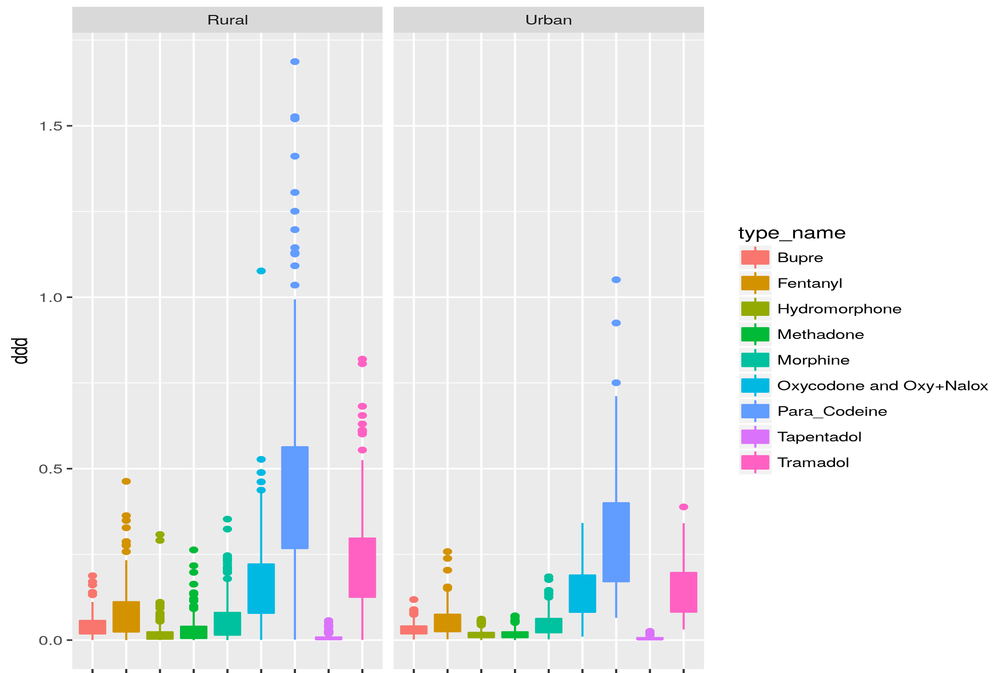
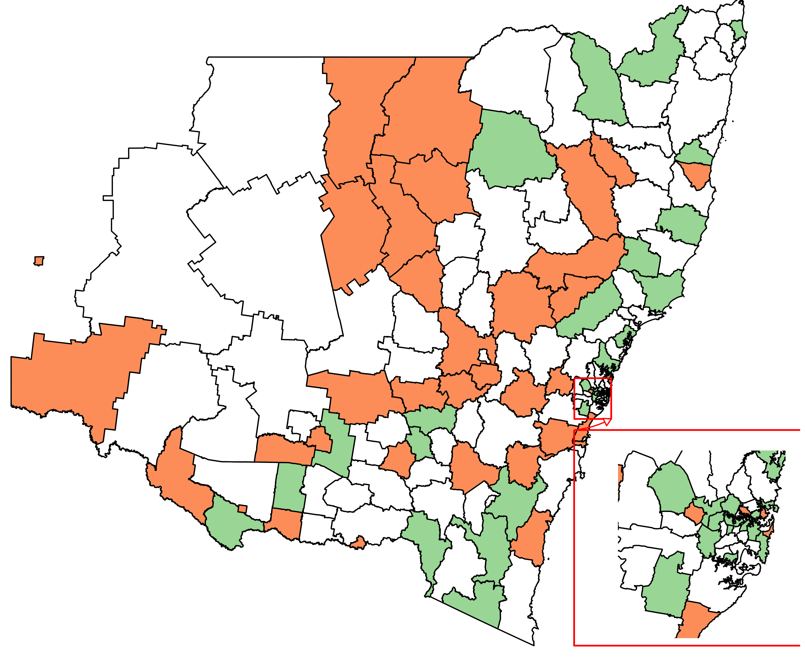
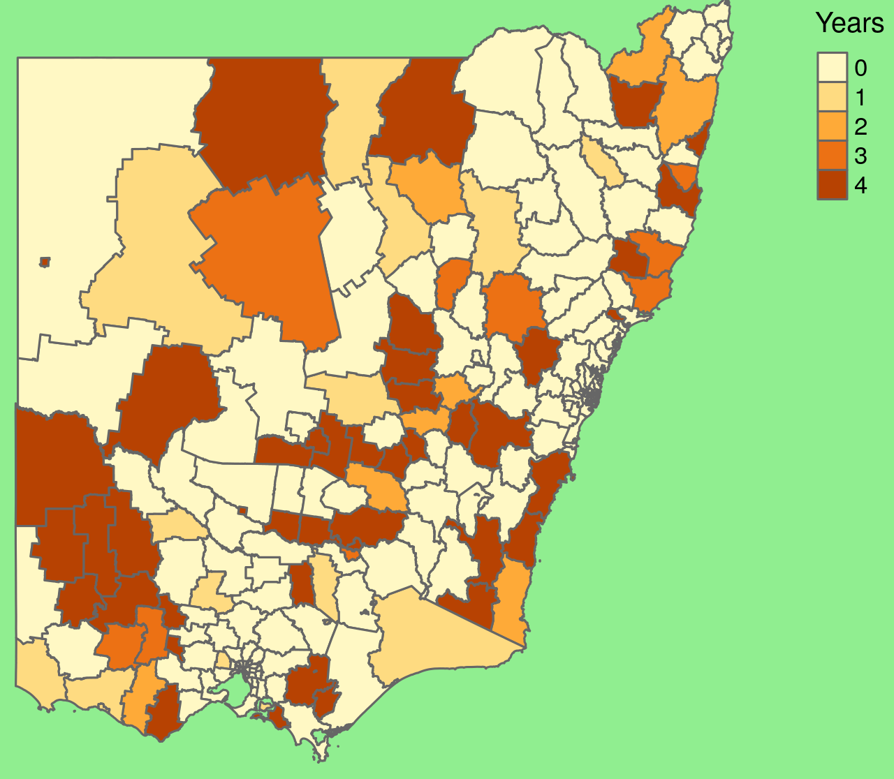

#Data is beautiful
  * So much data!
  * Advances in hardware and software mean that predictions will get cheap, so...
  * the things around prescriptions get valuable
  * Data is the new oil
---
# R
  * R makes data comprehendable - data toolkit
  * R used to be like Perl - dense, feature packed, but obtuse
    * tidyverse makes it beautiful
    * but still dense and feature packed!
---
# Administrative Medical Data
  * Australian Medical/Pharmaceutical Benefit Summary  (MBS / PBS)
  * what can you do with opioids?
## Technical fun facts - Daily Defined Dose (DDD)
  * DDD is standardised drug dose (daily dose per 1000 people) 
  * World Health Organisation.  Used for comparing different types of drugs.  
  * In opioids, it is the cancer dosage level, so kind've high.  Cancer hurts!
---

### Fun with Opioids - Boxplot all variable combinations

---

---

---

### Fun with Opioids AND the census
  * Opioids 
    * DDD (daily defined dose) is a standardised drug measurement
    * one dataset has total DDD by Local Government Area (LGA)
  * Census
    * 15000 categories
    * also has LGA 
  * How about joining them together?

---
# Top 10 Highly Coorelated 2011 Census Variables with Opioid Usage by LGA

|Census Category                                                                           |
|:-----------------------------------------------------------------------------------------|
|Total Family households Total                                                             |
|Separate house Number of persons usually resident Two                                     |
|Separate house Total                                                                      |
|Separate house Total Number of persons usually resident in family households Two          |
|Separate house Family households Total                                                    |
|Total Dwelling structure Separate house                                                   |
|Separate house Total                                                                      |
|Separate house Three bedrooms Number of persons usually resident in family households Two |
|Total Number of persons usually resident in family households Two                         |
|Separate house Family households Couple family with no children                           |

---
# Medical Data Availability
## Australian Government Generosity
 * Released 20 years of MBS, 10 years of PBS data
 * 10% of Australia population
 * Released under Creative Commons 4.0 license
 * can also request other data

##Data Heterogenaity

 * 7614 PBS Drugs
 * 5344 MBS Services 

## Outstanding tricky bits
 * How can we distribute it?
 * How to anonymize it?

